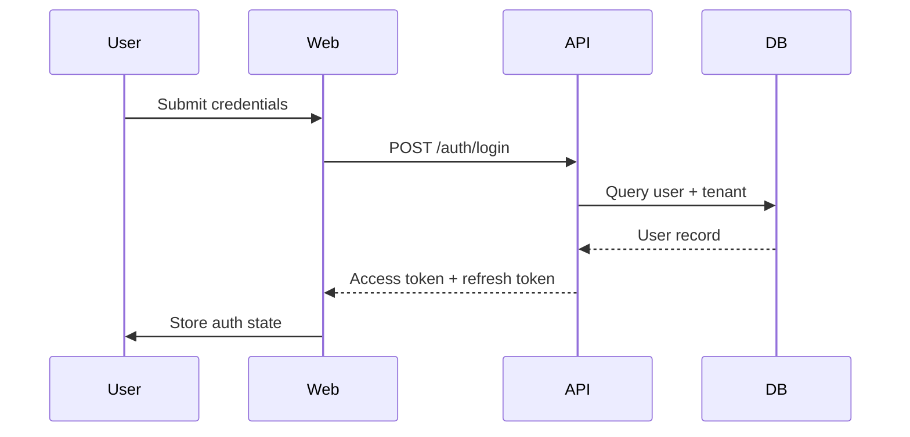
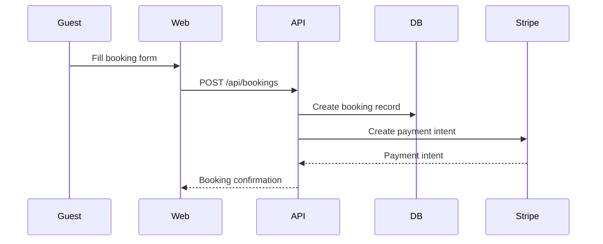

# ResortPro Architecture

## Multi-Tenancy

ResortPro uses a **shared database, shared schema** multi-tenancy model:

- Every table has a `tenantId` column
- The `tenantId` is extracted from the JWT token on every request
- Prisma queries always include `where: { tenantId }` — tenant isolation is enforced at the application layer
- Tenant slug is used for subdomain routing and public website URLs

### Why shared schema?

For small resort owners (our target), the simplicity of a single database is a better tradeoff than complexity of schema-per-tenant or database-per-tenant. Migration and maintenance are simpler at this scale.

## Authentication Flow

```
1. POST /auth/login
   → Validates credentials against DB
   → Issues short-lived JWT (15m) + long-lived refresh token (7d)
   → Refresh token stored in DB (RefreshToken table)

2. API Request
   → JWT verified by @fastify/jwt
   → { sub, email, role, tenantId } extracted from payload
   → Used in preHandler: requireAuth / requireRole

3. Token Refresh
   → POST /auth/refresh with refresh token
   → Old token deleted, new pair issued (rotation)

4. Mobile
   → Token stored in expo-secure-store (iOS Keychain / Android Keystore)
   → Same refresh flow via axios interceptor
```

## Real-Time Architecture

Live chat uses **WebSocket** via `@fastify/websocket`:

```
Guest opens ticket
→ Connects to ws://api/chat/ws/:ticketId
→ Staff replies via POST /tickets/:id/messages
→ Both sides update via WebSocket or polling
```

For the mobile app, ticket updates use **30-second polling** (simpler for MVP, push notifications planned for v2).

## Database Schema Principles

1. **Soft deletes** — Rooms and staff use `isActive: false` instead of hard deletion
2. **Decimal for money** — All prices stored as `Decimal(10,2)` to avoid floating point errors
3. **UUID primary keys** — All IDs use `uuid()` default
4. **Cascade deletes** — Child records cascade delete when tenant is deleted
5. **Composite unique indexes** — e.g. `[tenantId, roomNumber]` prevents cross-tenant collisions

## API Design

- **RESTful conventions** — standard HTTP verbs and status codes
- **Consistent response format** — `{ success, data }` or `{ success, error }`
- **Paginated lists** — `{ success, data[], pagination: { page, limit, total, totalPages } }`
- **Zod validation** — request body validated before handler executes
- **Error handler** — centralized error formatting in `app.ts`

## Frontend Architecture

```
Next.js App Router
├── Layouts
│   ├── Root layout (providers, fonts, globals.css)
│   ├── Dashboard layout (auth guard, sidebar, topnav)
│   └── Public layout (resort website)
├── State
│   ├── Zustand (auth store — persisted to localStorage)
│   └── React Query (server state — cached, refetching)
└── API Client
    └── Axios with interceptors (auto token refresh on 401)
```

## Mobile Architecture

```
Expo Router (file-based routing)
├── Auth flow (SecureStore for tokens)
├── Bottom tab navigation
├── React Query (same pattern as web)
└── Push notifications via expo-notifications
```

## System Architecture Diagrams

```mermaid
flowchart LR
  Web[Web App<br/>(Next.js)]
  Mobile[Mobile App<br/>(Expo)]
  Embed[Embed Widget]
  API[API Service<br/>(Fastify)]
  DB[PostgreSQL]
  Redis[Redis]
  Stripe[Stripe]
  Email[Resend / SMTP]

  Web -->|REST / GraphQL-style REST| API
  Mobile -->|REST| API
  Embed -->|REST| API
  API --> DB
  API --> Redis
  API --> Stripe
  API --> Email
```

## Sequence Flows

### Login flow



### Booking creation flow



## CI / Production Readiness

The repo already has a Docker build workflow for main branch images. For stronger production readiness, add a dedicated CI workflow that:

- installs workspace dependencies using `pnpm install`
- runs `pnpm test` for unit + integration coverage
- runs `pnpm test:coverage` for coverage reporting
- runs `pnpm build` to verify production build output
- optionally publishes artifacts or coverage reports

### Monitoring and observability

Recommended production observability:

- structured logs from Fastify and `pino`
- error tracking / exception alerts via Sentry or similar
- request and uptime monitoring via a lightweight health endpoint
- Redis and Postgres availability checks in Docker Compose or deployment platform
- log retention and search for API errors and webhook failures

### Billing and payment readiness

Production billing should include:

- secret environment variables: `STRIPE_SECRET_KEY`, `STRIPE_WEBHOOK_SECRET`, `STRIPE_PRICE_*`
- payment webhook validation and retry logic for Stripe events
- pricing plans and feature gating in the tenant model
- explicit fallback for manual / cash payments when gateway is unavailable
- invoice and expense reconciliation for revenue vs cost tracking

### Deployment checklist

- `NODE_ENV=production`
- `JWT_SECRET` and `JWT_REFRESH_SECRET` set securely
- `DATABASE_URL` points to a managed Postgres instance
- `CORS_ORIGIN` / `NEXT_PUBLIC_API_URL` match deployed domains
- `RESEND_API_KEY` configured for email delivery
- `STRIPE_SECRET_KEY` and `STRIPE_WEBHOOK_SECRET` configured for live payments
- health check endpoint available for uptime probes
- automatic DB migration on deploy via `prisma migrate deploy`
